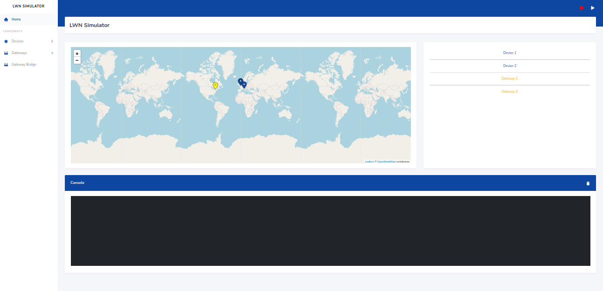

# LWN Simulator
[](https://www.travis-ci.com/UniCT-ARSLab/LWN-Simulator)
[](https://github.com/UniCT-ARSLab/LWN-Simulator/blob/main/LICENSE.txt)
[](https://golang.org)
[](https://github.com/UniCT-ARSLab/LWN-Simulator)
[](https://github.com/UniCT-ARSLab/LWN-Simulator/releases/)

A LoRaWAN nodes' simulator to simulate a LoRaWAN Network.

## Table of Contents
* [General Info](#general-info)
* [Requirements](#requirements)
* [Installation](#installation)
* [Tutorials](#tutorials)
* [Publications and Citations](#publications-and-citations)

## General Info
LWN Simulator is a LoRaWAN nodes' simulator equipped with a web interface. It allows to communicate with a real infrastructure LoRaWAN or ad-hoc infrastructure, such as [Chirpstack](https://www.chirpstack.io/).



The project consists of three main components: devices, forwarder and gateways. 

### The device
* Based [specification LoRaWAN v1.0.3](https://lora-alliance.org/resource_hub/lorawan-specification-v1-0-3/);
* Supports all [LoRaWAN Regional Parameters v1.0.3](https://lora-alliance.org/resource_hub/lorawan-regional-parameters-v1-0-3reva/).
* Implements class A,C and partially even the B class;
* Implements ADR Algorithm;
* Sends periodically a frame that includes some configurable payload;
* Supports MAC Command;
* Implements FPending procedure;
* It is possible to interact with it in real time;

### The forwarder
It receives the frames from devices, creates an RXPK object including them within and forwards to gateways.

### The gateway
There are two types of gateway:
* A virtual gateway that communicates with a real gateway bridge (if it exists);
* A real gateway to which datagrams UDP are forwarded.

## Requirements
* If you don't have a real infrastructure, you can download [ChirpStack open-source LoRaWAN® Network Server](https://www.chirpstack.io/project/), or similar software, to prove it;
* If you have a real infrastructure, be sure that the gateways and LoRaWAN servers are reachable from the simulator.


## Installation

### From binary file
You can download it from the releases section the pre-compiled binary file.

[Releases Page](https://github.com/UniCT-ARSLab/LWN-Simulator/releases) 

### From source code

#### Requirements
* You must install [Go](https://golang.org/ "Go website"). Version >= 1.16

Firstly, you must clone this repository:
```bash
git clone https://github.com/UniCT-ARSLab/LWN-Simulator.git
```
After the download, you must enter in main directory:

```bash
cd LWNSimulator
```
You must install all dependencies to build the simulator:
```bash
make install-dep
```
Now you can launch the build of the simulator:
```bash
make build
```

Finally, there are two modes to start the simulator:
* from source (without building the source)
```bash
make run
```
* from the built binary
```bash
make run-release
```

### From docker

First, build the docker image:
```bash
docker-compose build
```

Then, run the built container:
```bash
docker-compose up
```

### Configuration file
The simulator realises on a configuration file (`config.json`) which specifies some configurations for the simulator:

```json
{
    "address":"0.0.0.0",
    "port":8000,
    "configDirname":"lwnsimulator"
}
```

* address: specifies the IP mask from which the web UI is accessible.
* port: the web server port.
* configDirname: the directory name where all status files will be saved and will be created.

## Tutorials

### English
Coming Soon

### Italian
Coming Soon

### Arabic (thanks to [IdealBit](https://www.youtube.com/@IdealBit365))
[How to Install on Linux or WLS](https://www.youtube.com/watch?v=TEZcyVdanYE)

[How to Install on Windows](https://www.youtube.com/watch?v=BbemBm3Lzvo)

[How to use LWN Simulator with ChirpStack](https://www.youtube.com/watch?v=OpQkb00gfjs)

## Publications and Citations
[LWN Simulator-A LoRaWAN Network Simulator](https://ieeexplore.ieee.org/document/10477816)

[Lightweight Root Key Management Scheme in Smart Grid IoT Network based on Blockchain Technology](https://www.researchsquare.com/article/rs-3330383/v1)
