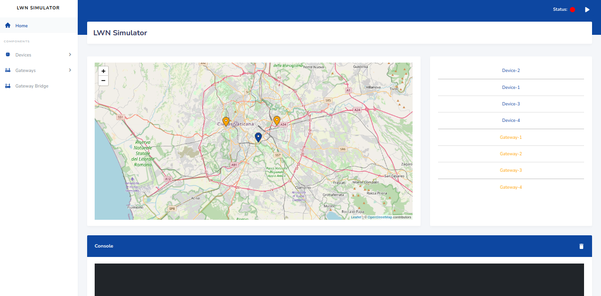

# LWN Simulator


[](https://github.com/UniCT-ARSLab/LWN-Simulator/blob/main/LICENSE.txt)
[](https://golang.org)
[](https://github.com/UniCT-ARSLab/LWN-Simulator)
[](https://github.com/UniCT-ARSLab/LWN-Simulator/releases/)

A LoRaWAN nodes' simulator to simulate a LoRaWAN Network.

## Table of Contents

* [General Info](#general-info)
* [Requirements](#requirements)
* [Installation](#installation)

## General Info

LWN Simulator is a LoRaWAN nodes' simulator equipped with web interface. It allows to comunicate with a real
infrastructure LoRaWAN or ad-hoc infrastructure, such as [Chirpstack](https://www.chirpstack.io/).



The project consists of three main components: devices, forwarder and gateways.

### The device

* Based [specification LoRaWAN v1.0.3](https://lora-alliance.org/resource_hub/lorawan-specification-v1-0-3/);
* Supports
  all [LoRaWAN Regional Parameters v1.0.3](https://lora-alliance.org/resource_hub/lorawan-regional-parameters-v1-0-3reva/).
* Implements class A,C and partially even the B class;
* Implements ADR Algorithm;
* Sends periodically a frame that including some configurable payload;
* Supports MAC Command;
* Implements FPending procedure;
* It is possibile to interact with it in real-time;

### The forwarder

It receives the frames from devices, creates a RXPK object including them within and forwards to gateways.

### The gateway

There are two types of gateway:

* A virtual gateway that communicates with a real gateway bridge (if it exists);
* A real gateway to which datagrams UDP are forwarded.

## Requirements

* If you don't have a real infrastructure, you can
  download [ChirpStack open-source LoRaWAN® Network Server](https://www.chirpstack.io/project/), or a similar software,
  to prove it;

> [!TIP]
> A ChirpStack instance can be easily started using Docker. You can find the
> instructions [here](https://www.chirpstack.io/docs/getting-started/docker.html).

## Installation

### From binary file

You can download from releases section the pre-compiled binary file.

[Releases Page](https://github.com/UniCT-ARSLab/LWN-Simulator/releases)

### From source code

#### Requirements

The simulator is written in Go, so you must have installed Go on your machine.

* You must install [Go](https://golang.org/). Version >= 1.21

> [!NOTE]
> Windows users should install [GnuMake for Windows](https://www.gnu.org/software/make/) to use the makefile.
> If you use winget, you can install it with the following command:
> ```bash
> winget install GnuWin32.Make
> ```

#### Build Steps

Firstly, you must clone this repository:

```bash
git clone https://github.com/UniCT-ARSLab/LWN-Simulator.git
```

After the download, you must enter in main directory:

```bash
cd LWN-Simulator
```

You must install all dependencies to build the simulator:

```bash
make install-dep
```

Now you can launch the build of the simulator:

```bash
make build
```

The binary file will be created in the `bin` directory.

#### Run the simulator

To run the simulator, you can:

- Run from the built binary file:

```bash
./bin/lwnsimulator // for Linux
./bin/lwnsimulator.exe // for Windows

make run-release // if you use makefile
```

- Run from the source code:

```bash
make run
```

### Configuration file

The simulator depends on a configuration file (`config.json`) which specifies some configurations for the simulator:

```json
{
  "address": "0.0.0.0",
  "port": 8000,
  "metricsPort": 8001,
  "configDirname": "lwnsimulator",
  "autoStart": false,
  "verbose": false
}
```

- `address`: the address where the simulator will listen for incoming connections;
- `port`: the port where the simulator will listen for incoming connections;
- `metricsPort`: the port where the simulator will listen for incoming connections for metrics (Prometheus);
- `configDirname`: the directory where the simulator will store the configuration files;
- `autoStart`: if true, the simulator will start automatically the simulation;
- `verbose`: if true, the simulator will print more logs.

## Tutorials

More coming soon...

### Arabic (thanks to [IdealBit](https://www.youtube.com/@IdealBit365))

[How to Install on Linux or WLS](https://www.youtube.com/watch?v=TEZcyVdanYE)

[How to Install on Windows](https://www.youtube.com/watch?v=BbemBm3Lzvo)

[How to use LWN Simulator with ChirpStack](https://www.youtube.com/watch?v=OpQkb00gfjs)

## Publications and Citations

- [LWN Simulator-A LoRaWAN Network Simulator](https://ieeexplore.ieee.org/document/10477816)
- [Lightweight Root Key Management Scheme in Smart Grid IoT Network based on Blockchain Technology](https://www.researchsquare.com/article/rs-3330383/v1)
- [Optimizing LoRa for Edge Computing with TinyML Pipeline for Channel Hopping](https://arxiv.org/abs/2412.01609)
- [Compute Continuum in Bioengineering: Enhanced Motion Capture and Real-Time Data Processing on Cloud-Edge Infrastructures](https://tesidottorato.depositolegale.it/handle/20.500.14242/188170)
- [ChirpPark: A Smart and Sustainable Parking System Protocol for Smart Cities and Multi-Agent Vehicles](https://ieeexplore.ieee.org/abstract/document/10697994)
